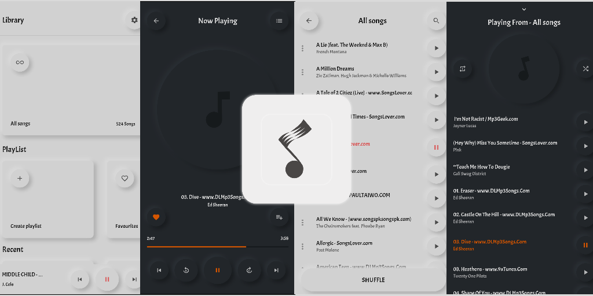
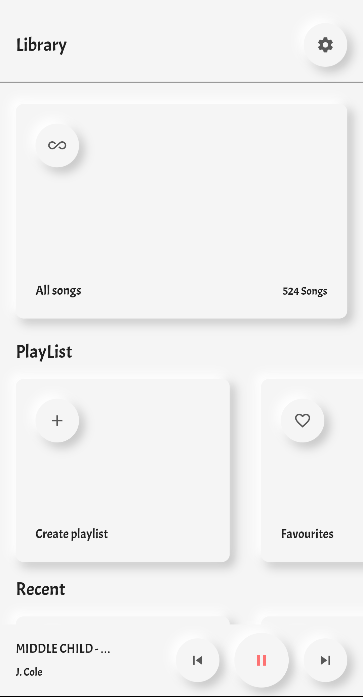
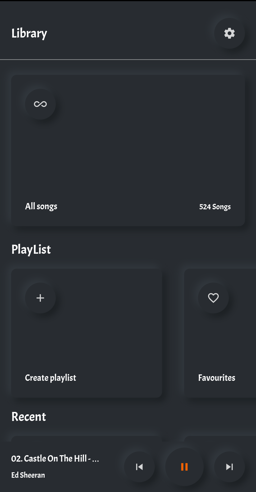
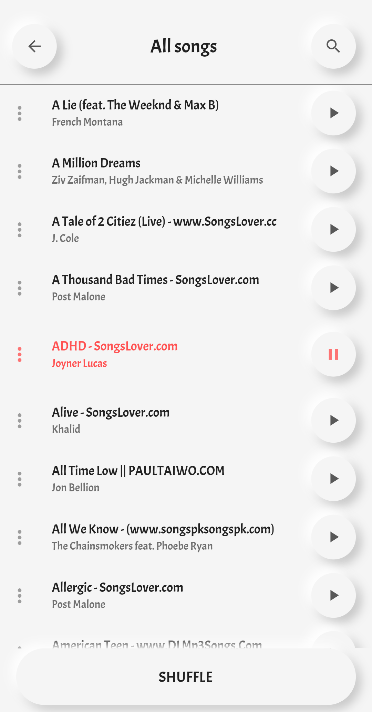
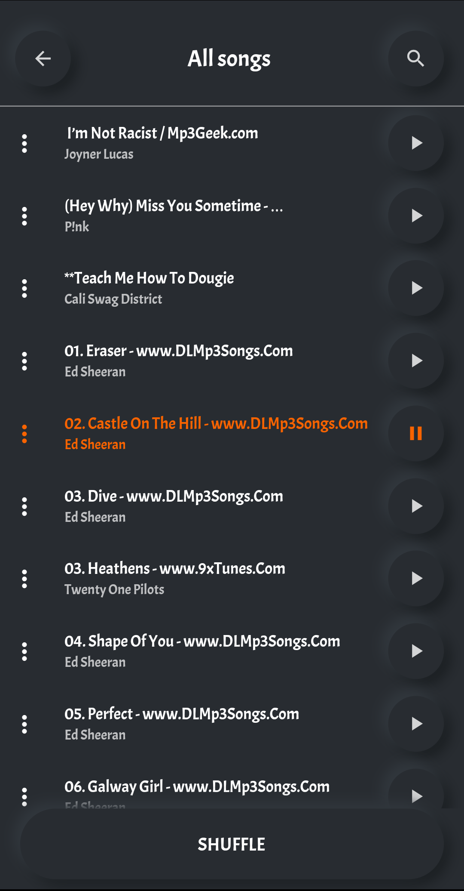
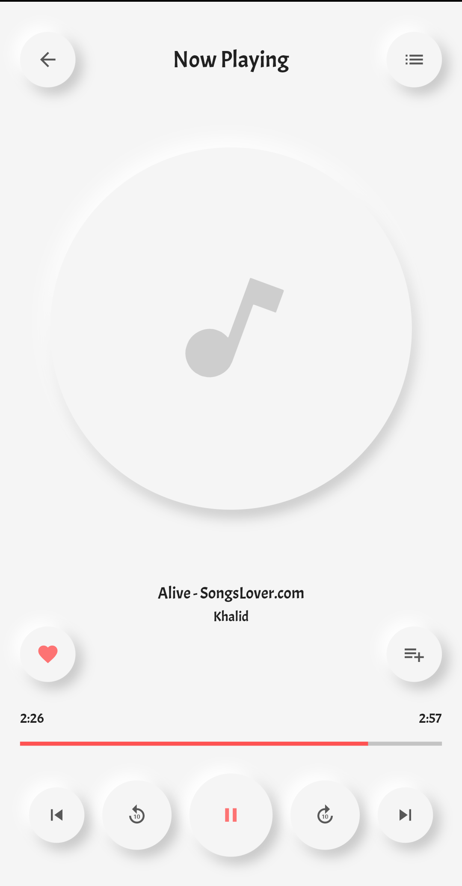
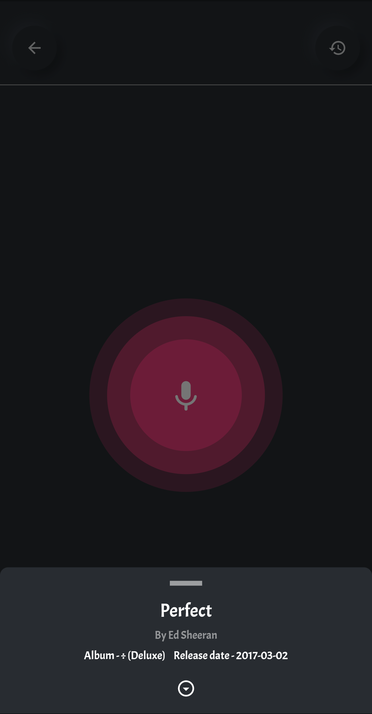
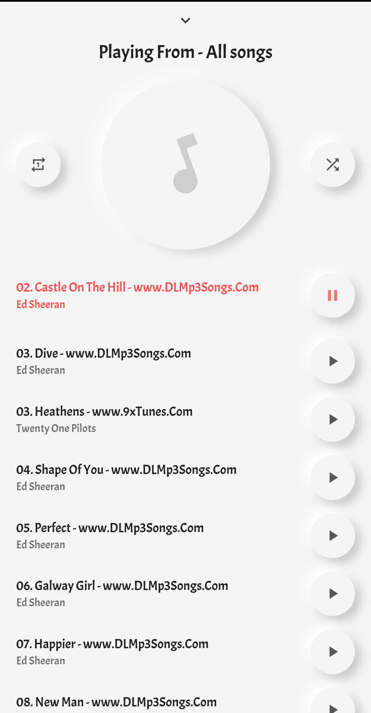
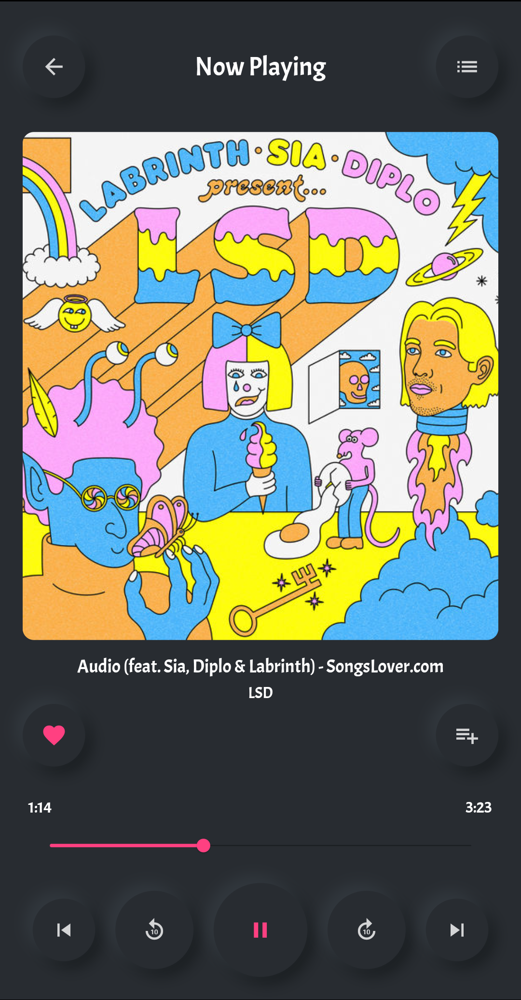

# 🎧🎧 Flutter Music 

A Flutter music player to play songs (mp3).

<a href="https://play.google.com/store/apps/details?id=com.onuifeanyi.vybeplayer"></img></a>
 
Please star⭐ the repo if you like what you see😉.
 

 

## 💻 Requirements
* Any Operating System (ie. MacOS X, Linux, Windows)
* Any IDE with Flutter SDK installed (ie. IntelliJ, Android Studio, VSCode etc)
* A little knowledge of Dart and Flutter

## ✨ Features
- [x] Play.
- [x] Pause.
- [x] Skip.
- [x] Seek.
- [x] Shuffle.
- [x] Repeate.
- [x] Delete.
- [x] Search.
- [x] Share music.
- [x] Create playlist.
- [x] Delete playlist.
- [x] Add to playlist.
- [x] Remove from playlist.
- [x] Dark Mode.

## 📸 ScreenShots

| Light| Dark|
|------|-------|
|||
|||
|||
|||
|||

## 🔌 Plugins
| Name | Usage |
|------|-------|
|[**Provider**](https://pub.dev/packages/provider)| State Management|
|[**Hive**](https://pub.dev/packages/objectdb)| NoSQL database|
|[**Just audio**](https://pub.dev/packages/xml2json)| Play audio|
|[**Audiotagger**](https://pub.dev/packages/dio)| Get mp3 metadata|
|[**Path & Path provider**](https://pub.dev/packages/http)| Access storage folders|
|[**Shared preferences**](https://pub.dev/packages/epub_view)| Store certain preference e.g dark mode|

## 🤓 Author(s)
**Onuoha ifeanyi.** 

## 🔖 LICENCE
    Copyright 2020 Onuoha Ifeanyi

    Licensed under the Apache License, Version 2.0 (the "License");
    you may not use this file except in compliance with the License.
    You may obtain a copy of the License at

       http://www.apache.org/licenses/LICENSE-2.0

    Unless required by applicable law or agreed to in writing, software
    distributed under the License is distributed on an "AS IS" BASIS,
    WITHOUT WARRANTIES OR CONDITIONS OF ANY KIND, either express or implied.
    See the License for the specific language governing permissions and
    limitations under the License.
